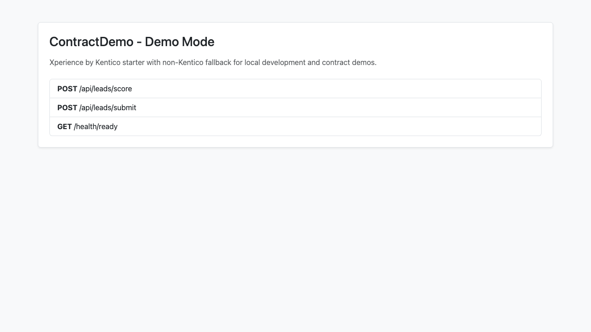

# ContractDemo

Contract-ready starter project for a non-headless Xperience by Kentico implementation style on ASP.NET Core (.NET 10), with a balanced frontend strategy using Razor, Vue 3, and Blazor.

## Goals

- Keep CMS-first (Kentico MVC) delivery model, not headless-only.
- Show practical integration boundaries for lead-gen use cases.
- Provide a local demo mode that runs without a Kentico database.

## Tech Stack

- CMS: Xperience by Kentico `31.1.1`
- Backend: ASP.NET Core `net10.0`
- Frontend composition: Razor Pages + Vue 3 + Blazor Server component
- Testing: xUnit

## Solution Structure

- `src/ContractDemo.Web`
	- Application host, startup pipeline, minimal APIs / controllers, pages, static assets
- `src/ContractDemo.Features`
	- Domain/feature logic (lead scoring)
- `src/ContractDemo.Integrations`
	- Integration adapters/contracts (lead submission client)
- `tests/ContractDemo.Web.Tests`
	- Service-level tests for feature/integration behavior
- `docs`
	- Contract pitch, architecture decisions, demo script, screenshots

## Design Decisions

1. **Modular monolith over microservices**
	 - Chosen for speed, maintainability, and lower operational overhead in contract MVP scope.
	 - Clear seams (`Web` / `Features` / `Integrations`) preserve future extraction options.

2. **Dual startup mode (Kentico mode + demo mode)**
	 - `Kentico:Enabled=true`: full Kentico startup path for real CMS runtime.
	 - `Kentico:Enabled=false`: local fallback mode that runs without CMS DB dependencies.
	 - This keeps onboarding fast while preserving real platform integration points.

3. **Frontend by intent, not by trend**
	 - Razor/Kentico MVC remains primary delivery mechanism.
	 - Vue 3 used for lightweight interactive campaign scenarios.
	 - Blazor component used for richer server-connected interaction patterns.

4. **Explicit integration boundary**
	 - External systems are abstracted behind interfaces in `ContractDemo.Integrations`.
	 - Enables mocking, testability, and cleaner replacement with real CRM connectors.

5. **Operational baseline in MVP**
	 - Health endpoint included (`/health/ready`).
	 - Tests focus on business logic reliability without requiring full CMS infrastructure.

## Runtime Modes

### 1) Demo Mode (default)

Use this for local demos when no Kentico DB is available.

- Config:
	- `Kentico:Enabled = false`
- Expected behavior:
	- Lightweight home UI at `/`
	- Lead APIs available
	- Health endpoint available

### 2) Kentico Mode

Use this when running against a valid Xperience by Kentico environment.

- Config:
	- `Kentico:Enabled = true`
	- `CMSHashStringSalt` must be set
	- `ConnectionStrings:CMSConnectionString` must be set
- Expected behavior:
	- Kentico startup pipeline initialized
	- Kentico routing/middleware enabled

## Prerequisites

- .NET SDK 10.0+
- (Optional for screenshot automation) Node.js 18+ and Playwright
- Access to Kentico DB + secrets only if using Kentico Mode

## How to Run

### Quick Start (Demo Mode)

1. Restore and build:

```bash
dotnet restore
dotnet build
```

2. Run app:

```bash
dotnet run --project src/ContractDemo.Web --urls http://127.0.0.1:5080
```

3. Open:

- `http://127.0.0.1:5080/`
- `http://127.0.0.1:5080/health/ready`

### Kentico Mode

1. Set in config (or environment variables):
	 - `Kentico__Enabled=true`
	 - `CMSHashStringSalt=<your-salt>`
	 - `ConnectionStrings__CMSConnectionString=<your-connection-string>`

2. Run:

```bash
dotnet run --project src/ContractDemo.Web
```

## API Endpoints

- `POST /api/leads/score`
- `POST /api/leads/submit`
- `GET /health/ready`

Example lead scoring request:

```bash
curl -X POST http://127.0.0.1:5080/api/leads/score \
	-H "Content-Type: application/json" \
	-d '{
		"companySize": 1000,
		"hasBudget": true,
		"requestedDemo": true,
		"region": "North America",
		"industry": "FinTech"
	}'
```

## Testing

Run tests:

```bash
dotnet test ContractDemo.slnx --nologo
```

Current tests validate:
- lead scoring behavior
- lead submission reference generation

## UI Screenshot



## Known Notes

- NuGet may report transitive vulnerability warnings from upstream Kentico dependencies in this pinned version set.
- Demo mode is intentionally infrastructure-light; Kentico mode is for full platform runtime.

## Additional Documentation

- `docs/pitch-one-pager.md`
- `docs/architecture-decisions.md`
- `docs/demo-script.md`
kent